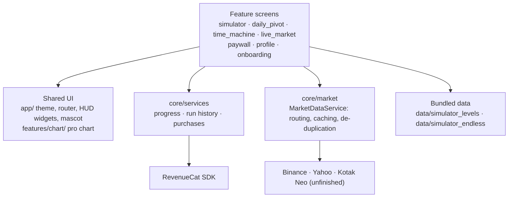
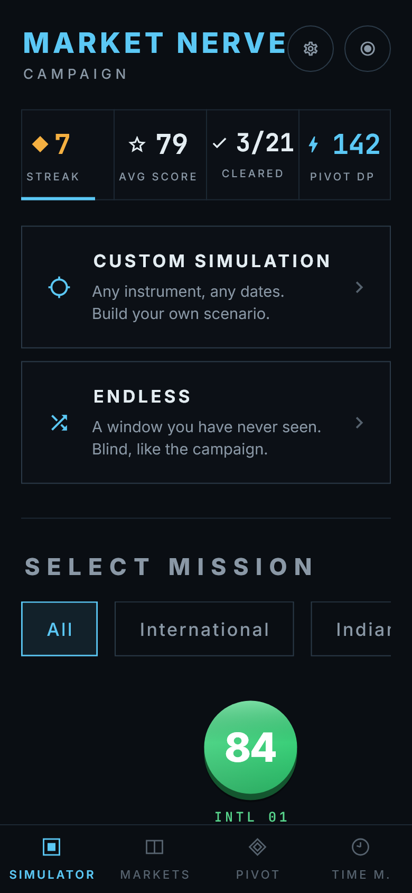
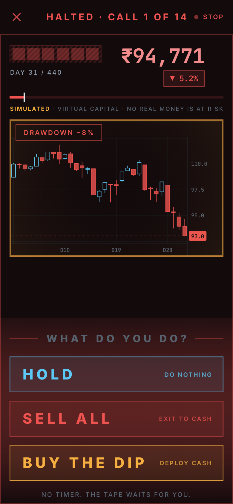
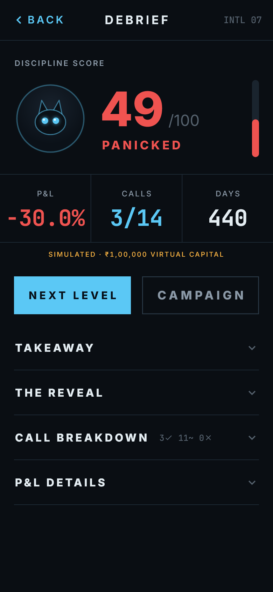
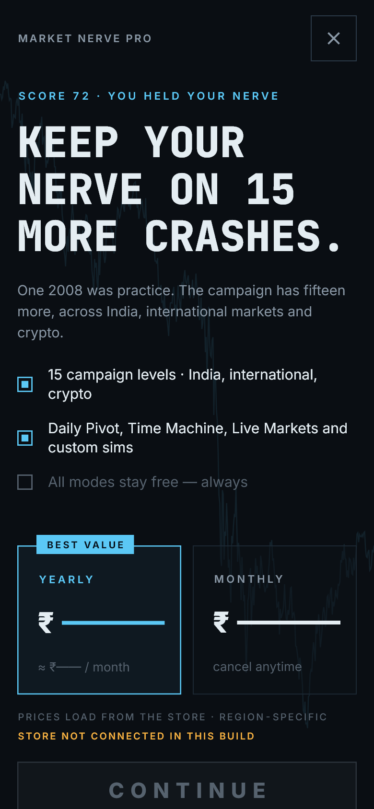
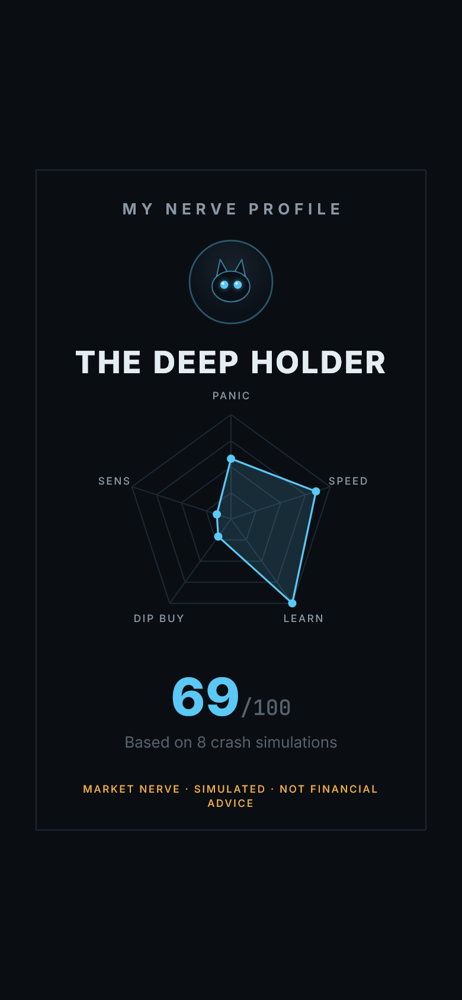

# Market Nerve

## What is it?

Market Nerve is a behavioural finance simulator for iOS and Android. You live through
real market crashes, fast-forwarded. At each pause point you make the call: hold, sell,
or buy the dip. Afterwards the app scores your discipline against what actually happened.

Most people think they'd hold through a crash. Market Nerve lets you find out, with
virtual capital, before it matters.

**No real money anywhere, ever.** The Simulator trades virtual capital. Live Markets
shows real prices but can't place an order. The Daily Pivot pays in-app Discipline
Points only.

Built for RevenueCat Shipaton 2026.

## Features

**Behavioural Simulator**
- **Campaign:** 17 playable historical crashes across US, Indian and crypto markets
  (2 free, 15 Pro). You play each one blind; the crash is named only after you've
  cleared it.
- **Pause points:** the tape stops at scripted moments, you pick Hold, Sell All or Buy
  the Dip, and there's no timer.
- **Debrief:** a Discipline Score out of 100 compared with the historically optimal
  move, with a call-by-call breakdown and P&L.
- **Endless:** random windows you've never seen, drawn from bundled price history.
- **Custom Simulation:** any instrument, any date range, any timeframe, from live data.

**Daily Pivot**
- One question a day: "Will BTC close above $X today?" Strike at 09:00 IST,
  resolved at 17:00 IST against Binance.
- One sealed vote; streaks; bonus points for a correct call against the crowd.

**Time Machine**
- A "what if I had invested…" compounding calculator with a shareable result card.
  No login.

**Live Markets**
- A watchlist of real prices across US equity, Indian equity and crypto. Each opens a
  full interactive chart.
- Read only. Every price shows its source and whether it's delayed.

**Also**
- **Nerve Profile:** a five-axis read of how you trade under stress, with a share card.
- **Pro chart:** pan/zoom, crosshair, four chart types, six indicators and three drawing
  tools, shared by every screen that draws prices.
- **Mascot:** a black kitten in a pearl-and-sapphire tiara on the loading screens, the
  first onboarding slide and the boot splash.

**Not built yet:** the Daily Pivot's shared crowd backend (the crowd split is a labelled
local placeholder), the Pivot's 09:00 and 17:00 notifications, and real-time NSE/BSE
through Kotak Neo.

## Tech Stack

| Area | Choice |
|---|---|
| App | Flutter, Dart ≥ 3.11.1, one codebase for iOS and Android |
| State | Riverpod 3 (`flutter_riverpod`) |
| Charts | A custom `CustomPainter` chart engine (`lib/features/chart/`) |
| Storage | `shared_preferences`: progress, scores, run history |
| Purchases | RevenueCat (`purchases_flutter` 10.10.1) |
| Media | `video_player` for the mascot clips; `share_plus` for share cards |
| Networking | `http`, calling public market APIs at runtime |
| Market data | Binance (crypto, real time); Yahoo Finance (US and Indian equity, delayed) |
| Fonts | Inter and JetBrains Mono, bundled |
| Web preview | Static Flutter web build hosted on Vercel |

Declared but not used yet: Firebase (Firestore and Cloud Functions, planned for the
Pivot crowd backend) and `flutter_local_notifications` (planned for Pivot reminders).

## Installation

You need:
- A Flutter stable release with Dart ≥ 3.11.1
- Xcode (for iOS) or Android Studio with an Android SDK (for Android)
- A device or emulator

```sh
git clone https://github.com/RedMonkey2664/RevenueCat.git
cd RevenueCat
flutter pub get
```

That's enough to run the app with the store disconnected. To enable purchases, add
RevenueCat keys (see [RevenueCat integration](#revenuecat-integration)).

## Running locally

**On a phone or emulator:**

```sh
flutter run                                                  # store disconnected
flutter run --dart-define-from-file=config/revenuecat.json   # with RevenueCat
```

**In a browser.** Firebase doesn't compile for web on this Dart SDK, so build with the
publish script, which leaves Firebase out, then serve the output folder:

```sh
bash tool/publish_web.sh
python -m http.server 8080 --directory web_dist              # open http://localhost:8080
```

`flutter pub get` adds the Firebase packages back into `pubspec.lock`, so restore the
committed lock (`git checkout -- pubspec.lock`) before committing.

What doesn't work in a browser:
- **US and Indian equity quotes:** Yahoo sends no CORS header.
- **File sharing and local notifications.**

Everything else works, including the Simulator, Time Machine and crypto prices.

**Checks:**

```sh
flutter analyze
flutter test
```

## RevenueCat integration

RevenueCat powers the **Market Nerve Pro** subscription: yearly or monthly. Pro
unlocks the 15 Pro campaign levels and the Nerve Profile's full report. Everything else
stays free.

**How it's wired**
- The app talks to the store through one interface, `PurchasesService`
  ([purchases_service.dart](lib/core/services/purchases_service.dart)).
- `RevenueCatPurchasesService`
  ([revenuecat_service.dart](lib/core/services/revenuecat_service.dart)) implements it on
  `purchases_flutter`. It's configured in `main()` before the app starts.
- **Prices** come from the current offering's **Annual** and **Monthly** packages,
  exactly as the store formats them.
- **Purchase and restore** go through the SDK. Cancelling the store sheet just closes it;
  real errors show a readable message.
- **Pro** means the **`pro`** entitlement is active. A customer-info listener pushes
  renewals, expiries and purchases made on other devices to every locked screen.
- **Without a key** for the platform, or if configuring fails, the app falls back to
  `StoreNotConnectedService`. The paywall then says the store isn't connected and offers
  a clearly labelled preview unlock, for that session only. The web preview and the
  tests run this way.

**Keys.** These are RevenueCat's public SDK keys, passed at build time and kept out of
git:

```sh
cp config/revenuecat.example.json config/revenuecat.json   # then fill in the keys
```

| Key | Platform |
|---|---|
| `RC_APPLE_KEY` | iOS, macOS |
| `RC_GOOGLE_KEY` | Android |
| `RC_WEB_KEY` | Web (needs RevenueCat Web Billing) |
| `RC_TEST_KEY` | Every platform, overriding the others. Development only. Never ship it. |

**Dashboard setup**
1. Add the App Store app (`com.marketnerve.marketNerve`) and the Play Store app
   (`com.marketnerve.market_nerve`), with their store credentials.
2. Import the monthly and yearly subscription products from both stores.
3. Create the entitlement `pro` and attach every product to it.
4. Create an offering, mark it **Current**, and add an **Annual** package and a
   **Monthly** package. The app ignores custom package types.

The full checklist, including store products, sandbox testing and review requirements,
is in [MONETIZATION.md](MONETIZATION.md).

## Architecture



Principles:
- **One Simulator engine.** Every campaign level, Endless window and Custom Simulation
  runs through `features/simulator/engine/`. A level is data, not code.
- **Sourced numbers only.** Level prices, dates and optimal moves are computed from real
  price series by `tool/import_yahoo_level.dart` and `tool/import_binance_level.dart`.
  Nothing is typed by hand.
- **Seams at the edges.** Market data sits behind one provider interface and the store
  behind `PurchasesService`, so tests and the web preview swap them without touching
  screens.
- **Separate pillars.** Each pillar has its own feature folder. They share the theme,
  the chart and the core services, nothing else.
- **Riverpod throughout,** with `shared_preferences` loaded once at startup and injected.

```
lib/
  app/            theme, router, phone frame, HUD widgets, mascot
  core/           market data providers, indicators, services
  features/       simulator, daily_pivot, time_machine, live_market, chart,
                  onboarding, paywall, profile
data/             bundled campaign levels and Endless history pools
tool/             data importers, web publish script, mascot keying, screen capture
test/             unit and widget tests
```

Design and spec docs: [ARCHITECTURE.md](ARCHITECTURE.md), [ENGINE.md](ENGINE.md),
[LEVELS.md](LEVELS.md), [DAILY_PIVOT.md](DAILY_PIVOT.md),
[TIME_MACHINE.md](TIME_MACHINE.md), [DESIGN.md](DESIGN.md),
[MONETIZATION.md](MONETIZATION.md), [MASCOT.md](MASCOT.md), [ROADMAP.md](ROADMAP.md).

## Screenshots

<p align="center">
  
  
  
  
  
</p>

Left to right:
1. Campaign home
2. A pause point
3. The Debrief
4. The Pro paywall, with no store connected, so no prices
5. The Nerve Profile share card

Rendered from the app by `tool/screens/capture_test.dart`
(`MN_SHOTS_DIR=build/screens flutter test tool/screens/capture_test.dart`). Level
screens use real bundled level data. The progress, scores and run history are sample
values.

## Demo

- **Web preview:** <https://revenue-cat-redmonkey2664s-projects.vercel.app>. The product
  ships on iOS and Android; this is the same app as a web build, with the limits listed
  under [Running locally](#running-locally).
- **Demo video:** not recorded yet.

## License

MIT. See [LICENSE](LICENSE).

The MIT licence covers this repository's source code. It doesn't cover:
- **The fonts,** Inter and JetBrains Mono, which are under the SIL Open Font License
  (see `assets/fonts/OFL.txt`).
- **The bundled market data** in `data/`, which comes from third-party providers.
  Its redistribution rights are **not yet verified**; see [LEVELS.md](LEVELS.md).
